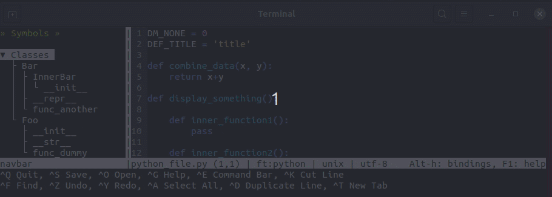

# Micro Navbar Plugin

Navigation bar listing symbols such as classes, functions, variables, etc. the the .




Supported Languages
-------------------
At the moment, only python, lua and the go programming language are supported, but it should be possible to add support for more programming languages (see below). Because I am using a line parser with some regular expressions, the plugin might not work with some coding style. Hopefully one day we will be using a proper parser to extract the relevant information.


How to use the plugin
---------------------

1. Install with `micro -plugin install navbar` (micro >=  2.0.2 required).

2. Open a file in a supported language (lua or python)

3. Press `Alt-n` or use the command `navbar`

4. A side window will appear with the structure of your file. You can navigate like in a normal buffer (using arrows, page up/down, find, etc.). You also have a few keybindings to make better use of the sidebar:

    - To jump to an object, select it in the sidebar and press 'g' (or use command `nvb_goto`).
    - To close all nodes, press 'c' (or use command `nvb_close_all`).
    - to open all nodes, press 'o' (or use command `nvb_open_all`).
    - to toggle a node between open and close (showing or not its children), press ' ' (or use command `nvb_toggle`).

You can change the keys for the actions in settings.json of micro. You can specify the theme to use for the tree, etc.)

There are 3 styles defined to display the tree: 'bare', 'ascii' and 'box'
```
* 'bare' style *

v Classes               > Classes
  v TestClass1            > TestClass1
    . __init__            . TestClass2
    . __str__           > Functions
  . TestClass2          > Variables
v Functions
  . TestFunction
v Variables
  . TestVariable


* 'ascii' style *

- Classes               - Classes
  - TestClass1            + TestClass1
  | . __init__            L TestClass2
  | L __str__           + Functions
  L TestClass2          + Variables
- Functions
  L TestFunction
- Variables
  L TestVariable


* 'box' style *

▾ Classes               ▾ Classes
  ├ TestClass1            ╞ TestClass1
  │ ├ __init__            └ TestClass2
  │ └ __str__           ▸ Functions
  └ TestClass2          ▸ Variables
▾ Functions
  └ TestFunction
▾ Variables
  └ TestVariable
```

Supporting other languages
--------------------------
To support a new language, you must provide a new lua module whose name is the filetype you want to add support for. For example to add support for the go language, you need to create a 'go.lua' file in 'navbar/supported'. This modue will have to provide the necessary function to extract the structure of a document written in that language. Follow the best practises for creating a new lua module:
```
local lgg = {} -- the module to add support for the go language.
```

Then you need to import some of the modules from the plugin to have access to a tree/node object and various constants (see lang.lua).

```
local gen  = require('../generic')
local tree = require('../tree')
local lg   = require('../lang')
```

Finally, you need to provide a function `lgg.export_structure(str)` which will take a string as argument (the content of the buffer), and returns a Tree (lg.Node object) of the various objects from the structure.

It is recommended to keep the children of the root for the 'categories' (such as 'classes', 'functions', 'constants', 'variables', etc.). For highly structured language (like python), you will want to set the functions of an object as a child of the object in the tree. For freeforms languages (like lua), you might need to do a bit of gymnastic to group together functions that are part of an object. You will want to extract all functions (including functions defined inside functions if you can), but limit yourself to the variables that have a global scope.

You may parse the buffer any way you want (I used line parser for python and lua), what matters is the tree you generate. When adding a node to a tree, you will need at least 3 pieces of information:
1. the label (usually the name of the item),
2. the kind of the object (found in the module lg),
3. the line the item can be found in the buffer.

If you want to handle objects hierarchy, you may have to record more information (such as indentation, block depth, etc.).  For example, for the python language, we record the indentation because it provides important information on how to build the hierarchy of objects.

For the go language, you would want to generate a tree like:
```
/
    Structures
        Struct1
        Struct2
    Functions
        Functions1
        Functions2
        Functions3
    Variables
        Variable1
        Variable2
```
That's it.


Supported Platforms
-------------------
This plugin has been developped under linux. It should work on most unix/linux derrivative (such as termux on android). It has not been tested on MacOS nor on Windows. Feel free to contribute to support these platforms.


Settings
--------
- openonstart: bool (true or false), set to true to open navbar for supported files when micro is open. Default to false.
- softwrap: bool (true or false), set to true to use wrapping in the treeview window. Default to false.
- persistent: bool (true or false), set to true to have the list of closed nodes be persistent when closing/opening micro. Default to false.
- treestyle: string ('bare', 'ascii', 'box'), the style to use to display the tree. Default to 'bare'.
- treestyle_spacing: int (0, 1, etc.), the number of extra-characters to use for the tree branches. Default to 0.
- treeview_rune_close_all: string (single letter), the key to use in the tree_view to close all nodes. Default to 'c'.
- treeview_rune_goto: string (single letter), the key to use in the tree_view to move the cursor in the main_view to the corresponding item. Default to 'g'.
- treeview_rune_open_all: string (single letter), the key to use in the tree_view to open all nodes. Default to 'o'.
- treeview_rune_toggle: string (single letter), the key to use in the tree_view to toggle a node with children between open and closed. Default to ' ' (space bar).


Known Bugs and Design Choice
----------------------------
- The structure of the navbar is only updated whenever you save the main buffer (to avoid micro spending its time continuously updating the navbar). If, when press 'g' (or use the `nvb_goto` command) you don't reach the appropriate line with the symbol, this is probably because you have added/removed content to the buffer and you have not saved the buffer yet).
- The 'openonstart' setting can be specified on a per-filetype basis, unfortunately, there is a small issue with micro at the moment (https://github.com/zyedidia/micro/issues/1596) that prevent it from working for buffers created after micro has started. It does work for the file (specified on the command line) that will be displayed by micro.
